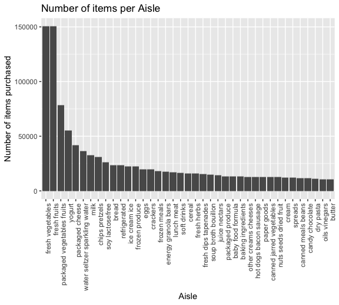
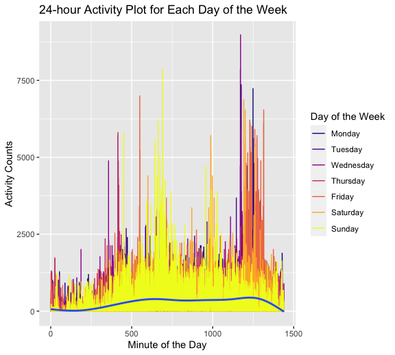

p8105_hw3_zz2780
================
Lydia Zhang
2022-10-11

Problem 1

``` r
library(p8105.datasets)
data("instacart")
```

The dataset instacart has 15 variables and 1384617 observations. Key
variables describe different products that are being ordered for each
order placed on instacart, including the product name and id, when it is
being ordered, the aisle and department it belongs to, and the times it
is reordered.

``` r
instacart %>%
  count(department, name="num", sort=TRUE)
```

    ## # A tibble: 21 × 2
    ##    department         num
    ##    <chr>            <int>
    ##  1 produce         409087
    ##  2 dairy eggs      217051
    ##  3 snacks          118862
    ##  4 beverages       114046
    ##  5 frozen          100426
    ##  6 pantry           81242
    ##  7 bakery           48394
    ##  8 canned goods     46799
    ##  9 deli             44291
    ## 10 dry goods pasta  38713
    ## # … with 11 more rows

There are 21 departments.

``` r
instacart %>%
  count(aisle, name="num", sort=TRUE)
```

    ## # A tibble: 134 × 2
    ##    aisle                            num
    ##    <chr>                          <int>
    ##  1 fresh vegetables              150609
    ##  2 fresh fruits                  150473
    ##  3 packaged vegetables fruits     78493
    ##  4 yogurt                         55240
    ##  5 packaged cheese                41699
    ##  6 water seltzer sparkling water  36617
    ##  7 milk                           32644
    ##  8 chips pretzels                 31269
    ##  9 soy lactosefree                26240
    ## 10 bread                          23635
    ## # … with 124 more rows

There are 134 aisles. Fresh vegetables aisle has the most items ordered
from.

``` r
instacart %>%
  count(aisle, name="num")%>%
  filter(num>10000)%>%
  ggplot(aes(x=reorder(aisle, -num), y=num))+
  geom_col()+
  theme(axis.text.x=element_text(angle=90,hjust=1)) +
  labs(title="Number of items per Aisle",x="Aisle", y="Number of items purchased")
```



The graph shows number of items ordered from each aisle exluding those
with less than 10000 items ordered, arranging in a descending order.

``` r
instacart%>%
  filter(aisle==c("baking ingredients", "dog food care", "packaged vegetables fruits"))%>%
  group_by(aisle, product_name)%>%
  summarize(num=n())%>%
  arrange(desc(num))%>%
  slice(1:3)
```

    ## `summarise()` has grouped output by 'aisle'. You can override using the
    ## `.groups` argument.

    ## # A tibble: 9 × 3
    ## # Groups:   aisle [3]
    ##   aisle                      product_name                                    num
    ##   <chr>                      <chr>                                         <int>
    ## 1 baking ingredients         Light Brown Sugar                               157
    ## 2 baking ingredients         Pure Baking Soda                                140
    ## 3 baking ingredients         Organic Vanilla Extract                         122
    ## 4 dog food care              Organix Grain Free Chicken & Vegetable Dog F…    14
    ## 5 dog food care              Organix Chicken & Brown Rice Recipe              13
    ## 6 dog food care              Original Dry Dog                                  9
    ## 7 packaged vegetables fruits Organic Baby Spinach                           3324
    ## 8 packaged vegetables fruits Organic Raspberries                            1920
    ## 9 packaged vegetables fruits Organic Blueberries                            1692

Among baking ingredients, light brown sugar, pure baking soda, and
organic vanilla extract are the three most popular items being ordered
157, 140, and 122 times respectively.

Among dog food care, organix grain free chicken & vegetable dog food,
organix chicken & brown rice recipe, original dry dog are the three most
popular items being ordered 14, 13, and 9 times respectively.

Among packaged vegetable fruits, organic baby spinach, organinc
raspberries, and organic blueberries are the three most popular items
being ordered 3324, 1920, and 1692 times respectively.

``` r
instacart%>%
    filter(product_name==c("Pink Lady Apples", "Coffee Ice Cream"))%>%
    group_by(product_name, order_dow)%>%
  summarize(mean_hour=mean(order_hour_of_day))
```

    ## Warning in product_name == c("Pink Lady Apples", "Coffee Ice Cream"): longer
    ## object length is not a multiple of shorter object length

    ## `summarise()` has grouped output by 'product_name'. You can override using the
    ## `.groups` argument.

    ## # A tibble: 14 × 3
    ## # Groups:   product_name [2]
    ##    product_name     order_dow mean_hour
    ##    <chr>                <int>     <dbl>
    ##  1 Coffee Ice Cream         0      13.2
    ##  2 Coffee Ice Cream         1      15  
    ##  3 Coffee Ice Cream         2      15.3
    ##  4 Coffee Ice Cream         3      15.4
    ##  5 Coffee Ice Cream         4      15.2
    ##  6 Coffee Ice Cream         5      10.3
    ##  7 Coffee Ice Cream         6      12.4
    ##  8 Pink Lady Apples         0      12.2
    ##  9 Pink Lady Apples         1      11.7
    ## 10 Pink Lady Apples         2      12  
    ## 11 Pink Lady Apples         3      13.9
    ## 12 Pink Lady Apples         4      11.9
    ## 13 Pink Lady Apples         5      13.9
    ## 14 Pink Lady Apples         6      11.6

The resulting table shows that for each day of the week, the mean hour
of the day at which Pink Lady Apples and Coffee Ice Cream are ordered.

Problem 2

``` r
accel<-read_csv("data/accel_data.csv")%>%
  pivot_longer(
    activity.1:activity.1440,
    names_to="minute",
    names_prefix="activity.",
    values_to="counts"
  )%>%
  mutate(
    type=ifelse(day==c("Sunday",  "Saturday"), "Weekend", "Weekday")
  )%>% 
  relocate(type, .before=minute)
```

    ## Rows: 35 Columns: 1443
    ## ── Column specification ────────────────────────────────────────────────────────
    ## Delimiter: ","
    ## chr    (1): day
    ## dbl (1442): week, day_id, activity.1, activity.2, activity.3, activity.4, ac...
    ## 
    ## ℹ Use `spec()` to retrieve the full column specification for this data.
    ## ℹ Specify the column types or set `show_col_types = FALSE` to quiet this message.

``` r
accel$minute<-as.numeric(accel$minute)
accel$day<-factor(accel$day, levels=c("Monday","Tuesday","Wednesday","Thursday","Friday","Saturday","Sunday"))
```

The data set contains 6 variables and 50400 observations. Variables
include the week, day, type of the day (weekend/weekday), and the minute
accelerometer collects the activity counts, and the number of counts.

``` r
accel%>%
  group_by(week, day)%>%
  summarize(sum_counts=sum(counts))
```

    ## `summarise()` has grouped output by 'week'. You can override using the
    ## `.groups` argument.

    ## # A tibble: 35 × 3
    ## # Groups:   week [5]
    ##     week day       sum_counts
    ##    <dbl> <fct>          <dbl>
    ##  1     1 Monday        78828.
    ##  2     1 Tuesday      307094.
    ##  3     1 Wednesday    340115.
    ##  4     1 Thursday     355924.
    ##  5     1 Friday       480543.
    ##  6     1 Saturday     376254 
    ##  7     1 Sunday       631105 
    ##  8     2 Monday       295431 
    ##  9     2 Tuesday      423245 
    ## 10     2 Wednesday    440962 
    ## # … with 25 more rows

The resulting table shows the daily total activity for each week. There
is no apparent trend observed.

``` r
accel%>%
  ggplot(aes(x=minute,y=counts))+
  geom_line(aes(color=day))+
  geom_smooth()+
  viridis::scale_color_viridis(
    option="plasma",
    name = "Day of the Week", 
    discrete = TRUE
  )+
  labs(title="24-hour Activity Plot for Each Day of the Week", y="Activity Counts", x="Minute of the Day")
```

    ## `geom_smooth()` using method = 'gam' and formula 'y ~ s(x, bs = "cs")'



From the graph, we can observe that earlier in the day, individual would
have less activity counts, and the number increases as the day goes.
During the middle of the day, individual has more activities counts on
Sunday that on any other day. As we move onto later in the day,
individual has more activities counts on all days in the week except for
Sunday.

Problem 3
